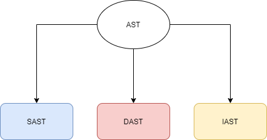
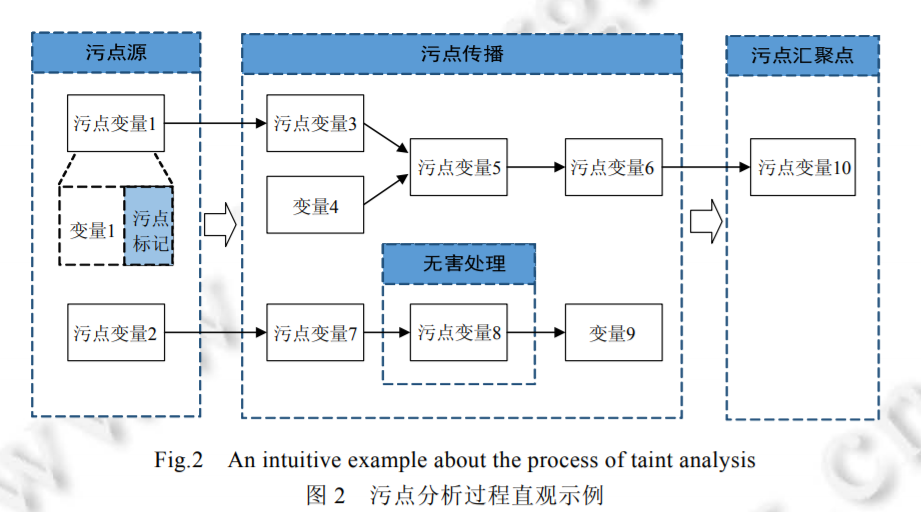
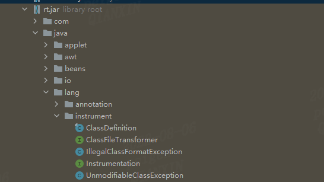

[TOC]


## 自动化安全测试工具链

RSAC2018正式提出了黄金管道的概念


### AST（Application Security Testing）
应用安全测试
AST（Application Security Testing）包括传统SAST白盒静态应用安全测试、黑盒DAST动态应用安全测试以及新一代，IAST交互式应用安全测试技术


### SAC
SCA第三方组件成分分析(Software Composition Analysis)技术，主要就是针对开源软件（OSS）以及第三方商业软件涉及的各种源码、模块、框架和库，以识别和清点开源软件（OSS）的组件及其构成和依赖关系，并识别已知的安全漏洞或者潜在的许可证授权问题，把这些风险排查在应用系统投产之前，同时也适用于应用业务运行中的诊断分析。


### RASP
在2014年的时候，Gartner引入了“Runtime application self-protection”概念，简称为RASP。它是一种新型应用安全保护技术，它将保护程序像疫苗一样注入到应用程序中（运行时插桩），与应用程序融为一体，能实时检测和阻断安全攻击，使应用程序具备自我保护能力，当应用程序遭受到实际攻击伤害，就可以自动对其进行防御，而不需要进行人工干预。


## AST


### SAST(Static Application Security Testing)
静态应用程序安全测试，对应用代码直接进行白盒分析，缺点误报率高，
扫描源代码。

### DAST（Dynamic Application Security Testing）
动态应用程序安全测试 对应用程序进行黑盒分析，这意味着它们不能访问代码或实现细节
缺点 检出率低
扫描运行时的应用程序

### IAST 为什么诞生
IAST的老技术就是SAST和DAST传统的应用安全测试主要包括SAST（静态应用安全测试）和DAST（动态应用安全测试）。 SAST对应用程序源代码进行白盒分析。分析是在代码的静态视图上运行的，这意味着代码在被检测时并没有运行，SAST的误报率无法得到有效控制，并且难以适用处于生产阶段的系统。 DAST对应用进行黑盒测试，无法访问代码细节。DAST产品不用关注底层的技术和平台，因此使用度更广泛，准确率也有不错的保障。但DAST的技术特性决定了其高漏报率的结果，且无法应用于应用的研发阶段。而如今，作为入选Gartner十大信息安全技术的IAST（交互式安全测试），结合了SAST和DAST的优点，低误报率和高检出率同时得到了保证。


IAST能同时访问代码及API流量


## IAST

### 原理

### 插桩
程序插桩?到底啥是插桩? 插桩是一种测试程序性能、检测错误、获取程序执行信息的技术(来源IBM，及维基百科) 插桩技术(Program Instrumentation)最早由J.C. Huang 在1978年发表到IEEE的《Program Instrumentation and Software Testing》提出的。在保证被测程序原有逻辑完整性的基础上在程序中插入一些探针(probe),即添加一些代码，获得程序的控制流和数据流信息。例如通过自动工具或手动，在函数执行前后插入读取计时器的代码，获取函数执行时间。可见，程序插桩是一项有着悠久历史的技术，主要应用在软件测试中，其实就是我们比较熟悉的测试方法，比如我们在源代码的函数执行前打印当前时间，在函数之后再次打印时间，进而计算函数的执行时间，找出影响软件性能的函数，就是源代码级别的程序插桩的一种应用。 


### 污点追踪
提起IAST，通常会提到污点传播模型，对于java来说一般有两种实现方式：一种是将java基本数据结构，如String、集合等用注入技术进行重写，添加污点变量来进行追踪，部分功能可能会用到native agent去实现；另一种是维护一张元数据表，记录污点变量的转换和传播。这两者都会引入海量的数据，尤其在大体系下，测试是规模化的事件，从而给数据挖掘和分析带来了巨大的挑战。


而在java tomcat环境下，有一种简单的实现方式，即在扫描器或功能测试时，可以添加taint magic number，如参数中，payload，header中，因为tomcat使用线程池机制，对于一个请求会分配一个线程处理，这样以一个request请求为单位，就可以构建出一条运行时的污点传播路径，由于没有实现污点变量，不能判断消毒点，但如果结合栈信息和sink点的参数检测，就可能在绝大多数情况下弥补这个问题。

#### 污点传播技术

污点分析可以抽象成一个三元组
1. source 污点源

代表直接引入不受信任的数据或者机密数据到系统中


2. sink 汇聚点

代表直接产生安全敏感操作(违反数据完整性)或者泄露隐私数据到外界(违反数据保密性)


3. sanitizer 无害处理

无害处理，代表通过数据加密或者移除危害操作等手段使数据传播不再对软件系统的信息安全产生危害


##### 污点分析常常包括以下几个部分


- 识别污点信息在程序中的产生点（Source点）并对污点信息进行标记(根据所分析的系统的不同使用定制的识别策略)

- 污点传播分析(利用特定的规则跟踪分析污点信息在程序中的传播过程)

- 漏洞检测、无害处理(在一些关键的程序点（Sink点）检测关键的操作是否会受到污点信息的影响)


###### 识别污点源汇聚点方法

- 使用启发式的策略进行标记,例如把来自程序外部输入的数据统称为“污点”数据,保守地认为这些数据有可能包含恶意的攻击数据(如 PHP Aspis)；

- 根据具体应用程序调用的 API 或者重要的数据类型,手工标记源和汇聚点(如 DroidSafe2)；

- 使用统计或机器学习技术自动地识别和标记污点源及汇聚点3


###### 污点传播分析

1. 显示流分析

污点传播分析中的显式流分析就是分析污点标记如何随程序中变量之间的数据依赖关系传播

2. 隐式流分析

污点传播分析中的隐式流分析是分析污点标记如何随程序中变量之间的控制依赖关系传播,也就是分析污点标记如何从条件指令传播到其所控制的语句。


#### 值匹配法
#### 污点跟踪算法

#### 栈签名算法
栈签名算法的主要工作是将运行时信息标准化，这样就可以把运行时信息做分析和检出。

具体而言，一个请求可能会命中若干个hook，hook会构造出一个有序序列，形成一个矢量，当多个请求过来时，多个矢量会形成一个矩阵，然后将矩阵作为输入构建一个trie树，当发生树的分支时，就把它之前hook的序列记录下来，做成栈签名，形成一条规则。
在实际使用中，一次测试分为两个阶段，第一个阶段是正常的输入，即通过QA跑功能测试，在这个阶段IAST会根据运行时信息生成一个规则集；第二个阶段，IAST通过扫描器构造一些POC、模糊测试的输入，对于新生成的规则和业务规则进行加黑处理。

数据集包括了正常输入、异常输入、报错型注入以及时间盲注，其中，报错型输入和异常输入都会产生异常，时间盲注和正常输入类似，但是运用栈签名算法，绝大多数的签名都可以正确的识别漏洞利用的路径


### 脏数据不落库
污点跟踪漏洞检测
主动插装根据插装对数据进行拦截


### 组件分析
IAST在组件分析方面具备一定的优势，因为 java本身会进行运行时的加载，所以在应用时可以得到更为丰富的信息，而白盒在做组件分析时，会出现一些难以解决的打包情况。


### 分析引擎


## IAST优点/缺点
### 优点

1. IAST的实际检测方式与人工代码审计的流程类似
2. 结合SAST DAST优点

### 缺点
1. 语言对插桩得支持
2. 依赖测试覆盖度
3. 插桩对于对系统不熟悉得人或者稍大型的项目有一点难度


### JAVA Agent

使用的工具包




使用JAVA Agent流程

1. 编写一个Agent类，其中定义premain方法并调用Instrumentation#addTransformer方法添加一个自定义的Transformer
2. 自定义一个Transformer类，实现Instrumentation接口，在transform方法中写入自己想要的AOP逻辑
3. 创建MANIFEST.MF文件，可以手动写也可以通过Maven的插件（pom.xml）
4. 打包Agent的jar包
5. 在需要使用JavaAgent的项目添加JVM启动参数-javaagent并指定我们打包好的jar

#### 两种运行方式
1. -javaagent:


```
public static void premain(String args, Instrumentation inst) {} 
public static void agentmain(String args, Instrumentation inst) {}
```

2. attach方式


```
public static void premain(String agentArgs, Instrumentation inst)    
public static void premain(String agentArgs)
```


Java Agent还限制了我们必须以jar包的形式运行或加载，我们必须将编写好的Agent程序打包成一个jar文件。除此之外，Java Agent还强制要求了所有的jar文件中必须包含/META-INF/MANIFEST.MF文件，且该文件中必须定义好Premain-Class（Agent模式）或Agent-Class:（Agent模式）配置，如：
```
Premain-Class: com.anbai.sec.agent.CrackLicenseAgent 
Agent-Class: com.anbai.sec.agent.CrackLicenseAgent
```
如果我们需要修改已经被JVM加载过的类的字节码，那么还需要设置在MANIFEST.MF中添加

```
Can-Retransform-Classes: true
Can-Redefine-Classes: true。
```


参数说明

1. Premain-Class ：包含 premain 方法的类（类的全路径名）
2. Agent-Class ：包含 agentmain 方法的类（类的全路径名）
3. Boot-Class-Path ：设置引导类加载器搜索的路径列表。查找类的特定于平台的机制失败后，引导类加载器会搜索这些路径。按列出的顺序搜索路径。列表中的路径由一个或多个空格分开。路径使用分层 URI 的路径组件语法。如果该路径以斜杠字符（“/”）开头，则为绝对路径，否则为相对路径。相对路径根据代理 JAR 文件的绝对路径解析。忽略格式不正确的路径和不存在的路径。如果代理是在 VM 启动之后某一时刻启动的，则忽略不表示 JAR 文件的路径。（可选）
4. Can-Redefine-Classes ：true表示能重定义此代理所需的类，默认值为 false（可选）
5. Can-Retransform-Classes ：true 表示能重转换此代理所需的类，默认值为 false （可选）
6. Can-Set-Native-Method-Prefix： true表示能设置此代理所需的本机方法前缀，默认值为 false（可选）