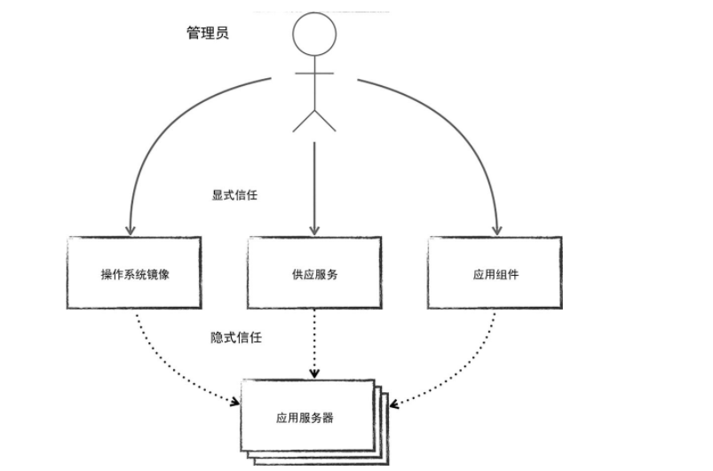
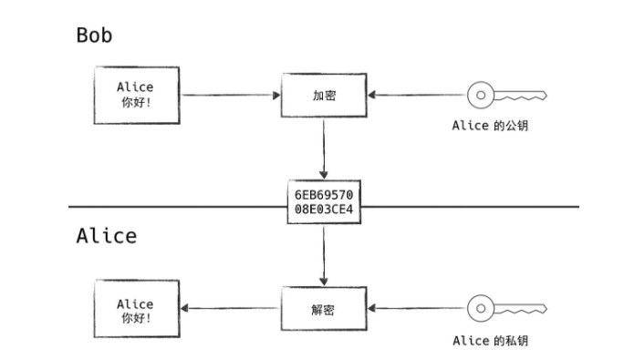
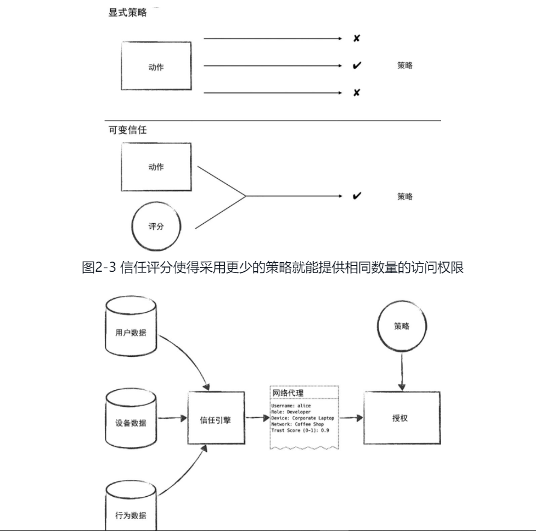
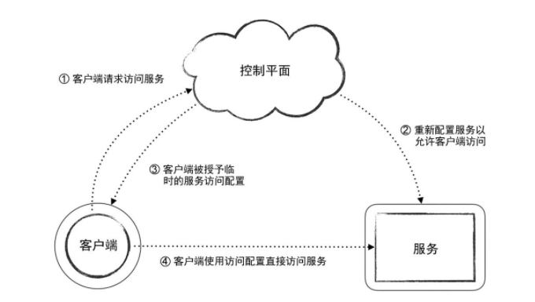

### 信任管理

#### 信任委托

由于用户量急剧增多，信任管理工作量会非常大，系统管理员数量不能无限制增加，并且系统管理员不能总是进行授权或者授予信任。

**如下图**

管理员信任某个特定的系统，这个系统又可以信任另一个系统，从而形成信任链

信任委托非常重要。借助信任委托，人们可以构建自动化系统，**目的**是为了无须认为干预的状况下，以安全可信的方式管理大规模增长的零信任网络。

信任链（Trust Chain）

管理员就必须将责任委托给供应系统，供应系统授予新主机授予信任的能力，供应系统已经确认过该服务是由它创建，供应系统还可以证明系统管理员权力授予。

信任锚（Trust Anchor）

系统管理员被称为信任锚。

#### 威胁模型

##### 威胁模型主要描述描述：

1. 攻击者能力

2. 攻击者资源

3. 攻击者目标

明确攻击者范围，按照攻击者的能力高低进行排序，构建威胁模型时也要从初级的攻击者开始考虑，这一点非常重要。

##### 常用威胁模型

• **STRIDE**。• **DREAD**。• **PASTA**。• **Trike**。• **VAST**。

##### 攻击者按照能力划分

- 碰运气攻击者

被称为脚本小子，没有明确目标，用众所周知的漏洞攻击广撒网，碰运气

- 定向攻击者

针对特定目标发起针对攻击，通过鱼叉邮件，社交工程等手段。俗称APT攻击

- 内部人员

有合法凭据的系统用户，外包人员非特权企业员工等

- 可信内部人员

可信度比较高的系统管理员

##### 零信任的威胁模型

**RFC 3552**

RFC 3552描述了互联网的威胁模型。一般情况下，零信任网络遵循互联网威胁模型来描述安全态势，规划缓解威胁的措施。

**关于端点设备**

零信任网络需要控制网络中的端点设备，所以它对互联网威胁模型进行了扩展，充分考虑了端点设备被攻陷的情形。面对端点设备可能遭受的攻击，通常的应对方式是首先对端点操作系统进行安全加固，然后采用端点系统安全扫描、系统活动行为分析等方式来进行攻击检测。

#### 强认证

零信任网络中不会对ip进行信任，因为该模型中认为攻击者能使用任意ip地址进行通讯。还能将自己置于两台计算机之间发起中间人攻击，每个访问请求都需要经过强身份认证。

用较广泛的身份认证机制是安全工程师们都非常熟悉的**X.509标准**

##### 问题

但该机制仍然依赖于一个秘密，而这个秘密可能会被窃取。通过网络**搭线窃听这种方式虽然行不通了，但是攻击者仍然可以使用恶意软件感染或物理接触的方式**窃取这个秘密

##### 存储方式上防御

因为上述原因虽然身份凭据的合法性可以得到验证，但是其机密性无法得到保证。实践中最好使用存储在不同位置的多个秘密，秘密的组合授予访问权限。攻击者必须窃取多个秘密才能完成攻击，这增加了攻击的难度。

##### 有效时间上防御

因此，所有身份认证凭据都应当有时间限制。为身份认证凭据设定有效期限，不仅能够最大限度地缩减凭据泄露或密钥被盗的影响范围，还可以给管理员更新密钥和重建信任创造更多的机会，争取更多的时间。管理员更改或更新密钥/口令的行为被称为**凭据轮换（Credential Rotation）**

##### 代价

人们应当尽可能避免使用难以轮换或者轮换成本很高的身份认证凭据，如硬件令牌/口令等，特别是新建的系统，应当在系统设计早期就考虑到这个因素。身份认证凭据的轮换频率通常与轮换所需的成本成反比

轮换代价高昂的凭据示例

- 需要外部机构签发的数字证书。
- 人工配置的服务账户。
- 需要系统重启才能重置的数据库口令。
- 一旦更改就会导致所有已保存的散列值失效的密钥种子

#### 信任认证

##### 公钥基础设施（PKI）

验证获得的公钥的确属于某人，PKI的目标是允许无特权的通信双方通过共同信任的第三方来验证对方身份的真实性。

PKI服务供应商有很多类型，其中证书授权中心（**CA**）和信任网络（**WoT**）是较受欢迎的两类供应商。

##### CA

CA的信任依赖于数字签名链，用户能够根据数字签名链回溯到初始的可信根节点。

##### WoT

许参与通信的系统断言对等方身份的有效性，最终形成相互背书的网状结构。

##### PKI的重要性

PKI是零信任模型身份认证的基石

以下实体可以使用数字证书来进行身份认证

设备

用户

应用程序

#### 最小特权

最小特权原则是指一个实体应该只被授予完成任务所需要的特权，而不是被授予该实体想要得到的权限。

隐私作为最小特权

？

人工认证

？

#### 可变的信任

##### 现在管理方式

系统管理员区分普通用户，超级用户。相当于系统管理员给用户分配角色。这种分配方式会导致黑客猎杀系统管理员的市场。安全的黄金准则应该是根本就不存在高特权的系统管理员。

网络参与者信任应该是基于参与者过去的行为不断变化的。

##### 加密流量的监听

客户端以不可信的方式开始访问会话请求，并在访问过程中通过各种机制不断积累信任，直到积累的信任足够获得系统的访问权限。比如，用户通过强认证能够证明所使用的终端设备属于公司，这可能积累了一些信任，但不足以获得账单系统的访问权限。接下来，用户提供了正确的RSA令牌，就可以积累更多的信任。最后，设备认证和用户认证相结合计算出的信任评分满足要求，用户就可以获得账单系统的访问权限了

##### 发现入侵者

1.延长用户信任所需正常行为的时间，可以延缓攻击者累计信任的进度。

2.把敏感操作的若干条信息公布给控制平面，配置成只有可信位置的可信用户才能访问。=>通过信任评分与设备和应用程序元数据绑定。

##### 需要考虑的几点重要因素

用户工作地点不同对用户会有不同限制，如用户在咖啡馆访问敏感资源被限制，但是在家里访问就不会遇到这种情况。

是否应该对用户提出越来越严格的身份要求？

为了累计更多的信任获得更高的访问权限，是否应该要求新用户在较低的访问全县辖工作一段时间。

用户携带故障的终端设备到信任地点（技术支持办公室）维修是否应该给这个用户增加额外的信任。

#### 控制平面和数据平面

控制平面和数据平面是网络系统经常使用的概念。

**原则**

任何数据平面执行的策略和行为，要尽量减少向控制平面发送请求。

控制平面数据平面得区别

##### 数据平面

应用程序，防火墙，代理服务器，路由器

这些系统处于网络连接路径上，对性能有要求。并且在网络中有比较广泛的暴露面。

##### 控制平面

控制平面由一系列组件构成

用来检查来自数据平面的请求

控制平面会影响数据平面的变化，这种机制分成重要。英文数据平面是攻击者进入网络的入口

数据平面和控制平面系统之间的交互请求必须使用私有PKI系统进行身份认证和加密，以确保接收方的可信度。

控制平面授予数据平面的某个参与者的信任应该具有时效性。信任应当是临时性的，信任委托方和信任受托方之间需要定期履行确认手续，才能保证持续信任的合理性。

