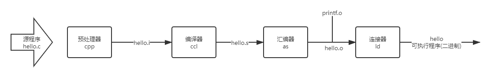

[TOC]

### 编译器

为什么要研究编译器呢？

了解编译器对系统如何工作大有帮助，

1. **优化程序性能。**

   了解编译器可以让集器代码及编译器编译出更高效的代码。如switch 是否比if高效，while循环是否比for循环高效，或者重新排列括号顺序能让系统执行更高效。

2. **理解链接时出现的错误**。

   比如连接器报告无法解析一个引用？静态遍历和全局变量的区别。不同的c语言中定义相同的静态变量会发生什么。

3. **避免安全漏洞**。

   如缓冲区溢出漏洞。是造成大多数网络和internet服务器上安全漏洞的原因。

#### 预处理阶段

#### 编译阶段

#### 汇编阶段

#### 链接阶段

